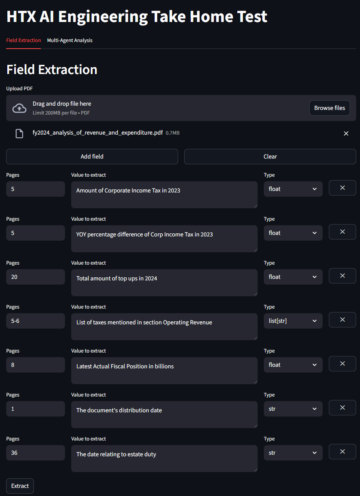
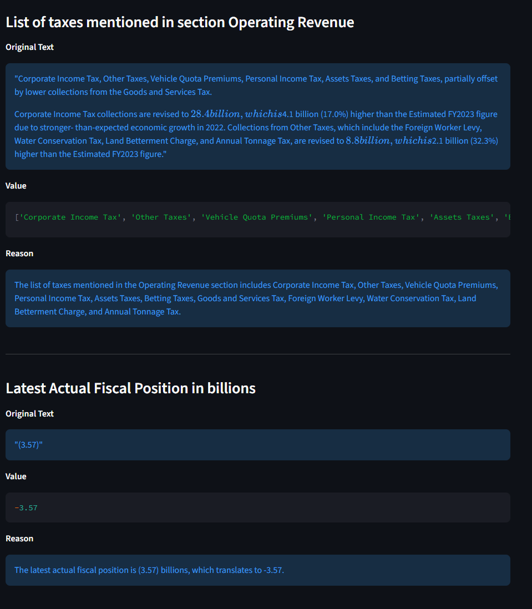
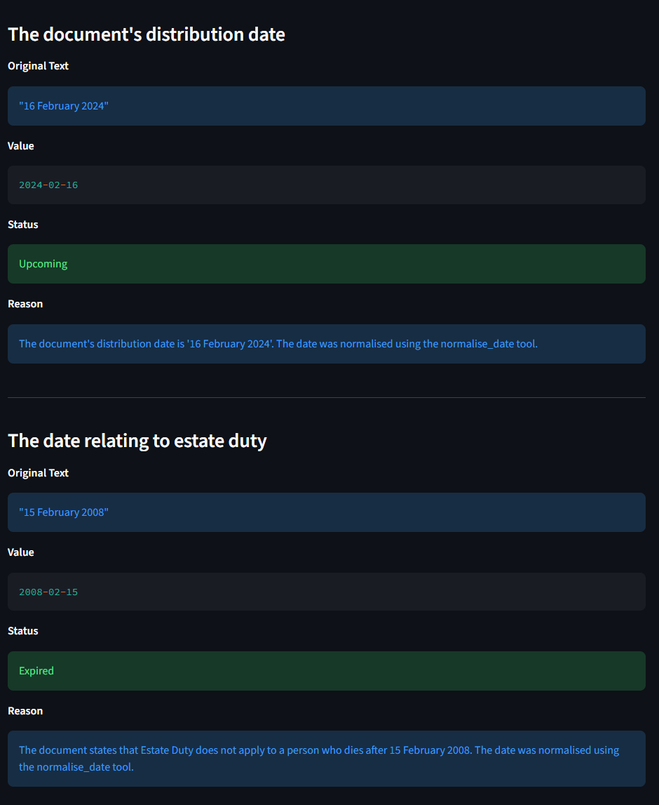
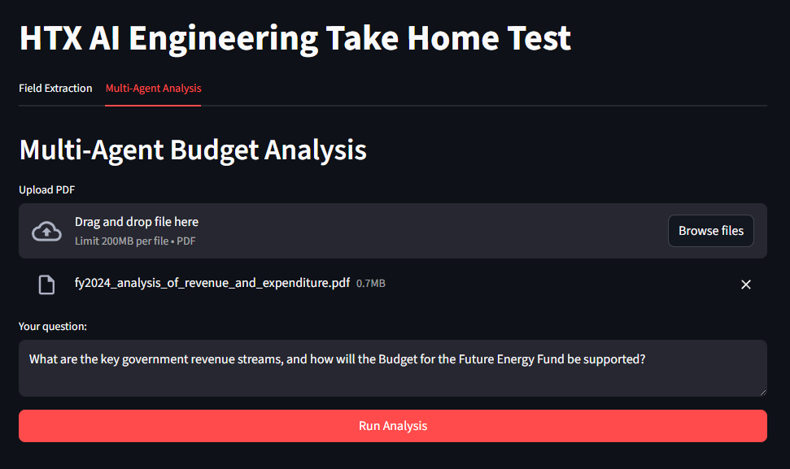
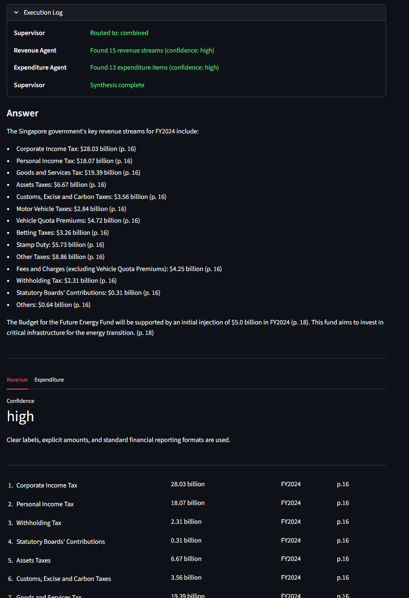

# HTX AI Engineering Take Home Test

## Quick Start

### Prerequisites
- Docker and Docker Compose in machine
- `.env` file with LLM API key

### Setup

1. **Clone repository**
```bash
git clone https://github.com/leezhanpeng/htx-ai-engineering-take-home-test.git
cd htx-ai-engineering-take-home-test
```

2. **Add .env into /api folder**

Expected `api/.env` structure:
```env
LLM_API_KEY=<KEY>
LLM_BASE_URL=<URL>
```

3. **Start the application**

In root, run:

```bash
docker compose up --build
```

4. **Access the dashboard**
- Dashboard: http://localhost:8501
- API endpoint is located at http://localhost:8000

## Features & Results

### Part 1 & 2: Document Extraction & Tool Calling

**Input:**


**Part 1 Output:**


**Part 2 Output:**

Note that specifically for date extraction, date normalisation tool will be called, and the status of the date is also included, relative to 2024-01-01


### Part 3: Multi-Agent System

**Input:**


**Output:**


## Technology Stack

### Backend
- **FastAPI** for backend endpoints
- **LangChain and LangGraph** for LLM orchestration, structured outputs and multi-agent workflows
- **Python MCP Library** for tool integration
- **PyMuPDF** for PDF text extraction

### Frontend
- **Streamlit** to more intuitively show output of various tasks

### LLM Provider
- Mainly using **Google Gemini 2.0 Flash**

## Project Structure

```
htx-ai-engineering-take-home-test/
├── api/
│   ├── app.py
│   ├── requirements.txt
│   ├── Dockerfile
│   ├── .env
│   ├── .env.sample
│   ├── mcp_client.py
│   ├── mcp_servers/
│   │   ├── data_extraction.py
│   │   └── tools/
│   │       └── date_normaliser.py
│   └── llm/
│       ├── agents/
│       │   ├── supervisor.py
│       │   ├── revenue_agent.py
│       │   └── expenditure_agent.py
│       ├── chains/
│       │   ├── data_extraction.py
│       │   └── date_classifier.py
│       ├── graphs/
│       │   ├── multi_agent_graph.py
│       │   └── state.py
│       └── prompts/
│           ├── data_extraction.py
│           ├── date_classifier.py
│           └── agents/
│
├── dashboard/
│   ├── app.py
│   ├── requirements.txt
│   └── Dockerfile
│
├── docker-compose.yml
└── README.md
```
